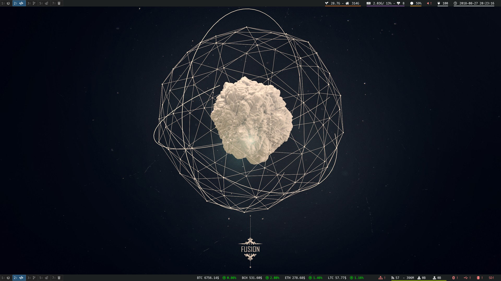
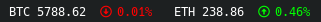
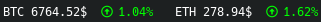

i3bar-coins
=========

*"Show crypto-currencies values in i3bar, in fiat-moneys (dollars, euros and so on)"*



# Installation

## Dependencies

* *i3-wm*
* *i3status*
* *conky >= 1.10.0*
* *font-awesome >= 5.0*

## Manual

```bash
$ git clone https://github.com/Ventto/i3bar-coins.git
$ cd i3bar-coins/
$ sudo make install
```

# Examples

For more details about option, loot at the `usage()` [function](./i3bar-coins.sh#L12).
```
Usage: i3bar-coins [-m CODE] [-p PLATFORM] [-c day] CURRENCY,...
```

* Show the Bitcoin and Ethereum values in Euro:

```bash
$ i3bar-coins --symbol --money EUR BTC

{ "full_text": "BTC 5788.62€", "separator_block_width": 14 },
{ "full_text": " 0.01%", "color": "#FF0000" },
```

# Integration

For those who already know how to customize their *i3bar* with *conky* ([or not](https://i3wm.org/docs/user-contributed/conky-i3bar.html)), use *i3bar-coins* as following:

```lua
conky.text = [[
  [
    ${exec i3bar-coins --money EUR --change day BTC,ETH}
  ],
]]
```



```lua
conky.text = [[
  [
    ${exec i3bar-coins --symbol --change week --platform coinbase BTC,ETH}
  ],
]]
```



# See Also

* Take a look at my dotfiles [repository](https://github.com/Ventto/dot/tree/master/.config/i3) as an integration example


* List all money codes:

```bash
$ curl -s "https://free.currencyconverterapi.com/api/v5/currencies" | \
  python -m json.tool
```

* List all crypto-currencies code:

```bash
$ curl -s "https://api.coinmarketcap.com/v2/listings/" | python -m json.tool
```

# FAQ

**Why doesn't the `--symbol` option display the fiat money's symbol ?**

* The example below shows a Bitcoin value in CFP Franc (or XPF) is money which has no symbol:
```
$ i3bar-coins --money XPF --symbol BTC
```
